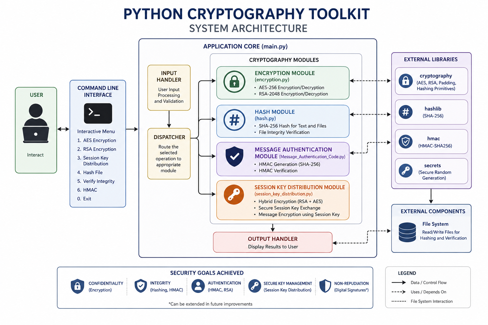
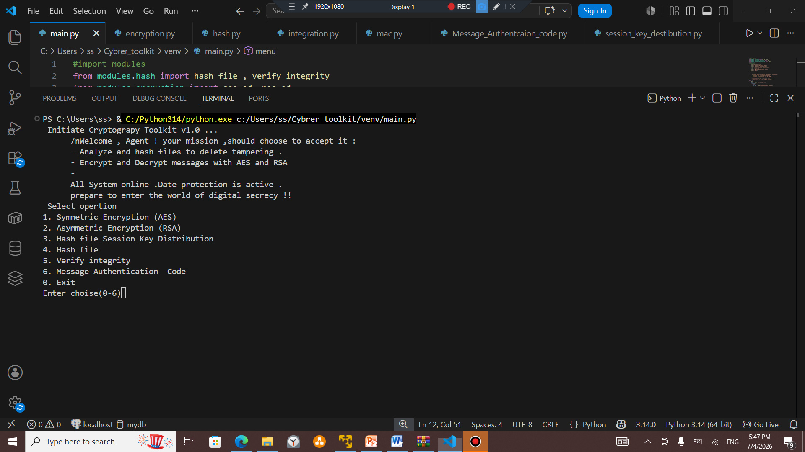
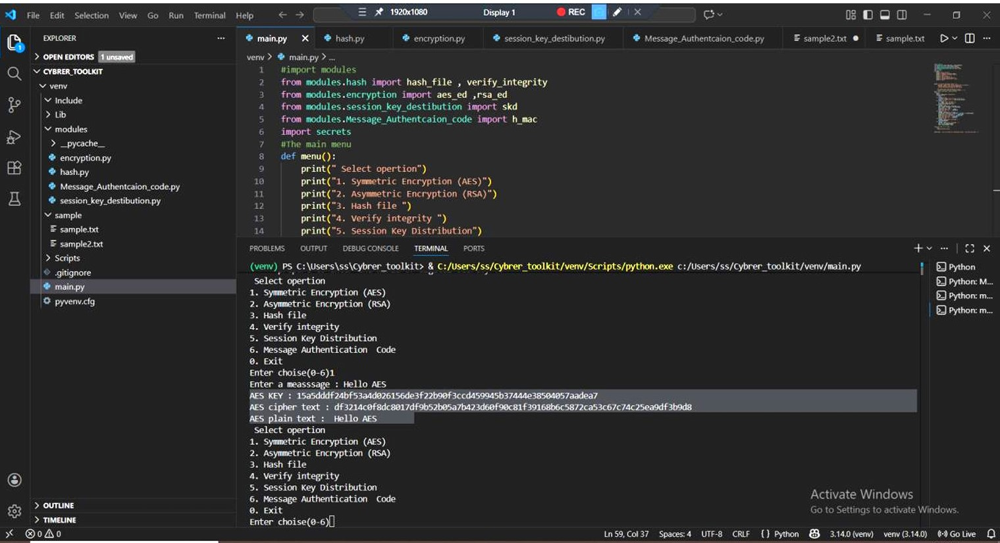
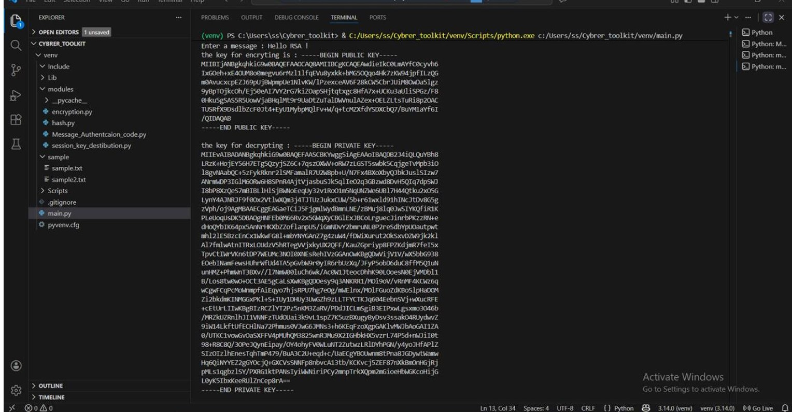
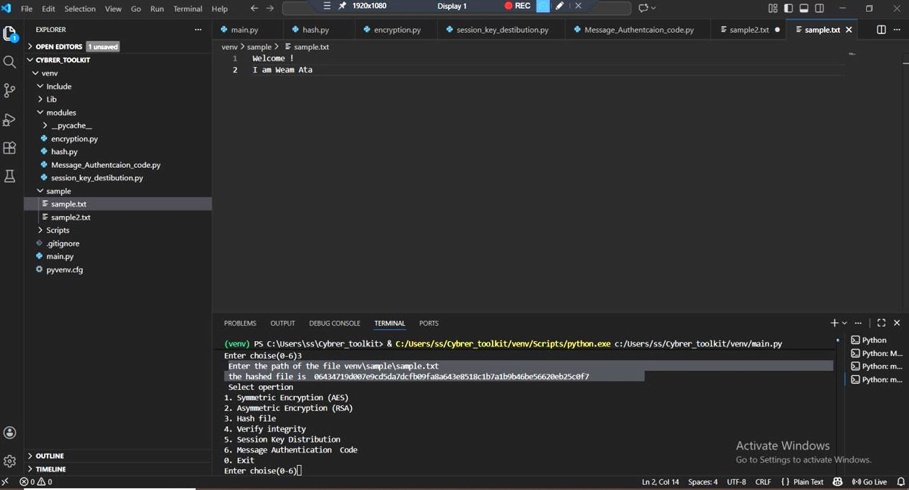
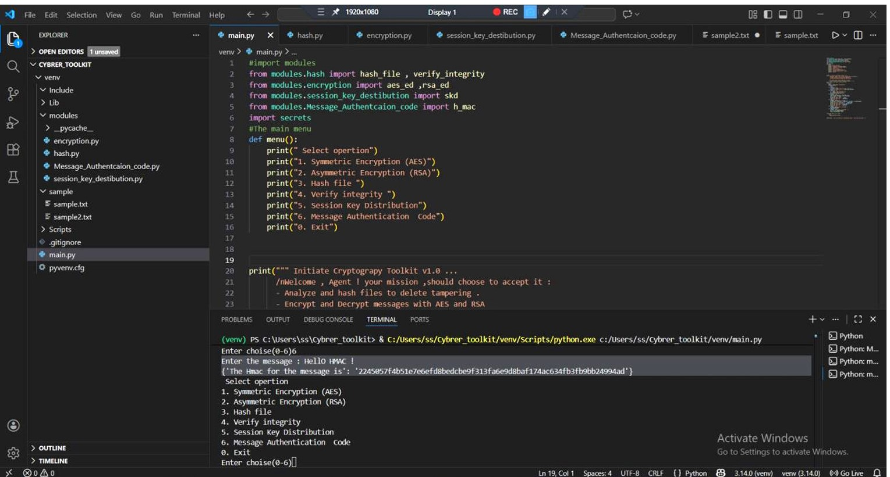
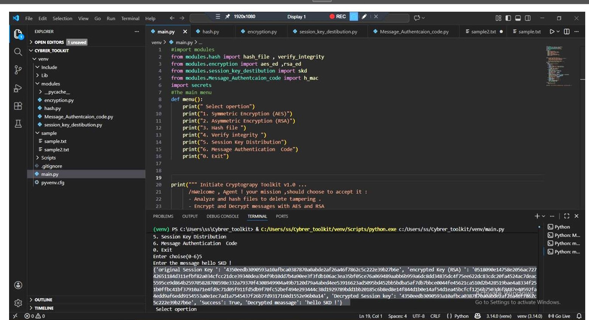

# Python Cryptography Toolkit

## Overview

Python Cryptography Toolkit is a modular command-line application developed to demonstrate the implementation of core cryptographic concepts using Python. The project combines symmetric encryption, asymmetric encryption, hashing, message authentication, and secure session key distribution into a single toolkit.

The primary objective of this project is to provide a practical implementation of modern cryptographic techniques used to ensure data confidentiality, integrity, authentication, and secure key management.

---

## Features

- AES-256 Symmetric Encryption
- RSA-2048 Asymmetric Encryption
- SHA-256 File and Message Hashing
- File Integrity Verification
- HMAC (Message Authentication Code)
- Hybrid Session Key Distribution
- Interactive Command-Line Interface

---

## System Architecture



---

## Project Structure

```text
python-cryptography-toolkit/
│
├── main.py
├── README.md
├── requirements.txt
│
├── modules/
│   ├── encryption.py
│   ├── hash.py
│   ├── Message_Authentication_Code.py
│   └── session_key_distribution.py
│
├── sample/
│
└── images/
```

---

## Technologies

- Python 3
- cryptography
- hashlib
- hmac
- secrets

---

## Security Components

### AES Encryption

Implements authenticated symmetric encryption using AES-GCM with randomly generated 256-bit keys and nonces.

---

### RSA Encryption

Implements RSA-2048 public-key cryptography using OAEP padding with SHA-256 for secure encryption and decryption.

---

### SHA-256 Hashing

Generates SHA-256 hashes for text and files to verify integrity and detect unauthorized modifications.

---

### Message Authentication Code (HMAC)

Generates and verifies HMAC values using SHA-256 to ensure message authenticity and integrity.

---

### Hybrid Session Key Distribution

Demonstrates hybrid cryptography by protecting an AES session key with RSA before encrypting the message.

---

## Installation

Clone the repository

```bash
git clone https://github.com/yourusername/python-cryptography-toolkit.git
```

Move into the project directory

```bash
cd python-cryptography-toolkit
```

Install dependencies

```bash
pip install -r requirements.txt
```

Run the application

```bash
python main.py
```

---

## Application Menu





---

## Demonstration

### AES Encryption



---

### RSA Encryption



---

### SHA-256 Hashing



---


### HMAC Authentication



---

### Session Key Distribution



## Learning Outcomes

This project provided practical experience with:

- Symmetric Cryptography
- Asymmetric Cryptography
- Hybrid Encryption
- Cryptographic Hash Functions
- Message Authentication
- File Integrity Verification
- Secure Key Exchange
- Secure Python Programming

---

## Future Improvements

- Digital Signatures
- Password Hashing using Argon2
- Secure File Encryption
- Graphical User Interface (GUI)
- TLS-Based Secure Communication
- X.509 Certificate Support

---

## License

This project is provided for educational and learning purposes.

---

## Author

**Weam Ata**

Computer Science Student

Areas of Interest

- Network Engineering
- System Administration
- Cybersecurity
- Python Development
